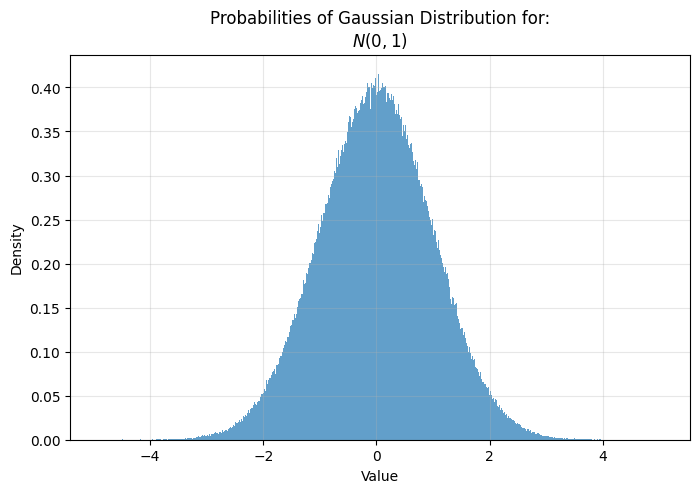
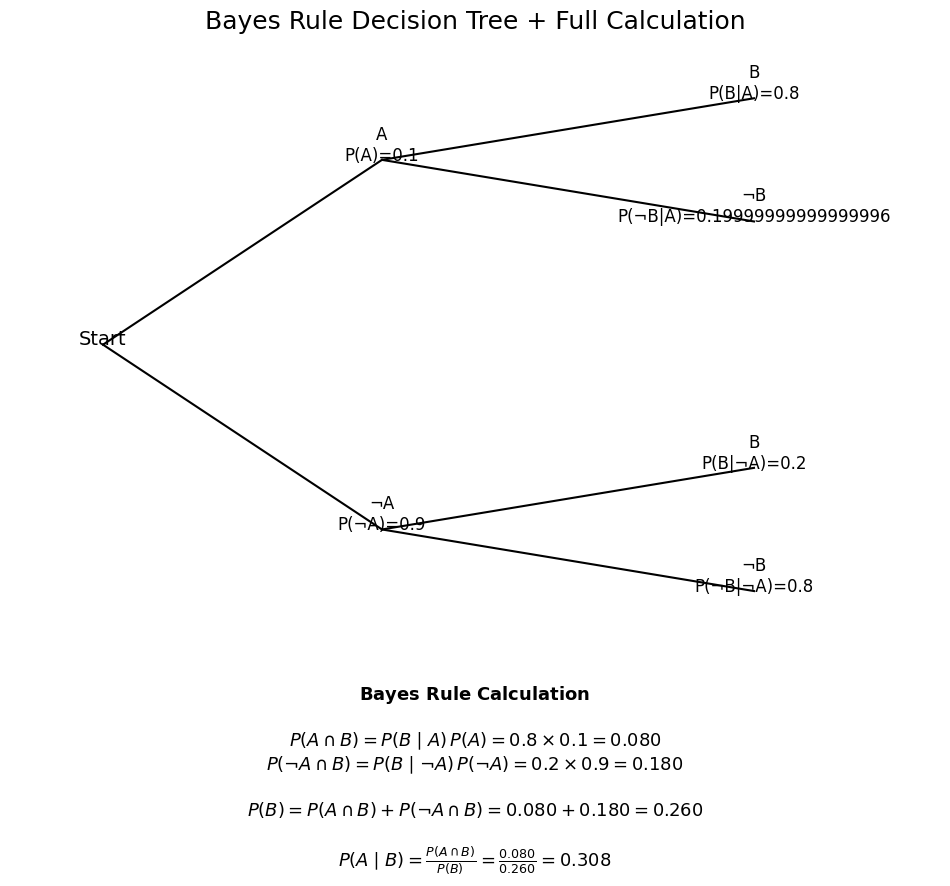
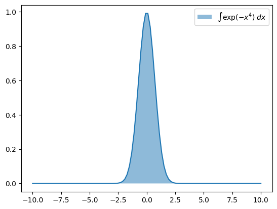
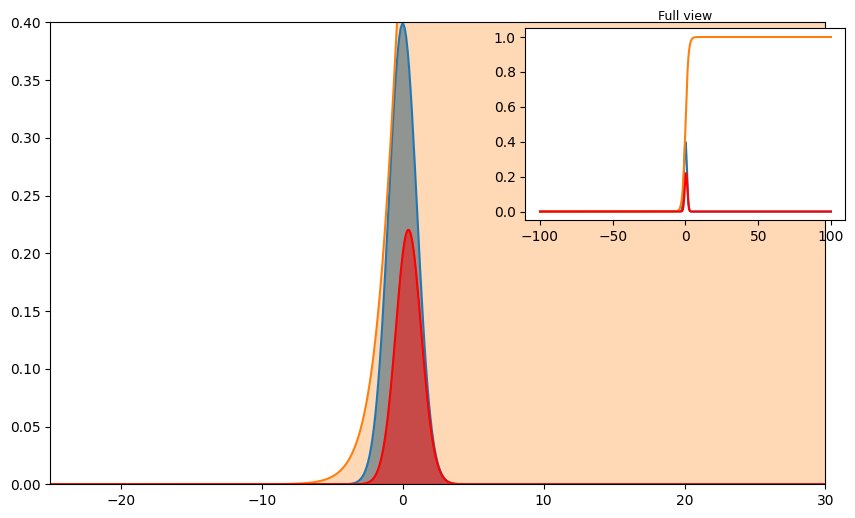
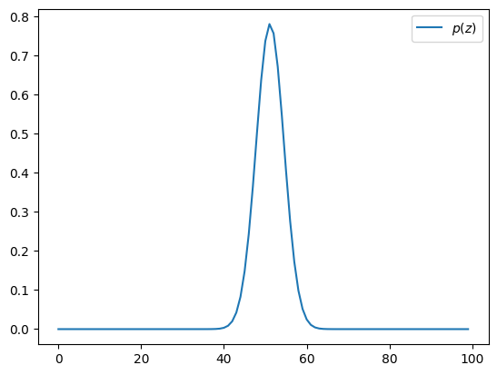
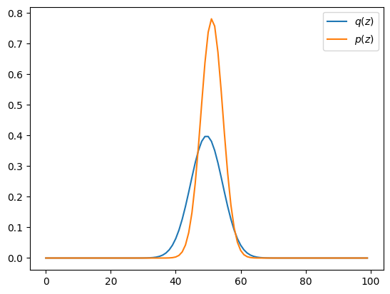
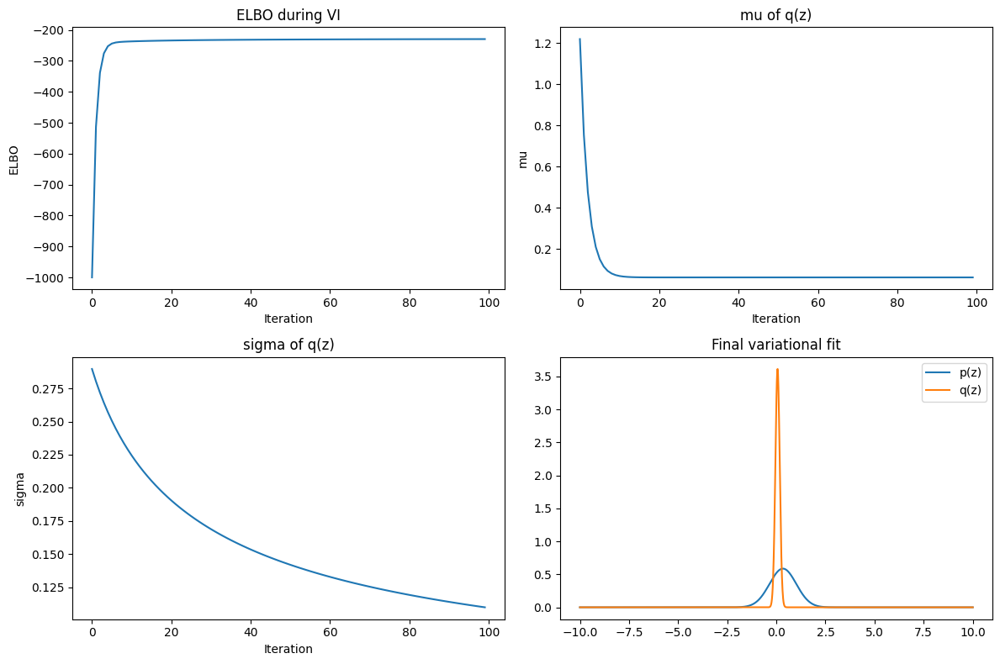

---
jupyter:
  colab:
    toc_visible: true
  kernelspec:
    display_name: Python 3
    name: python3
  language_info:
    name: python
  nbformat: 4
  nbformat_minor: 0
---

::: {.cell .markdown id="2KVlgyQbVUCH"}
## Intro
:::

::: {.cell .markdown id="I8ZyAf0dVVrt"}
While traditional Deep Learning relies on deterministic parameters
optimized via gradient descent, Probabilistic AI explicitly represents
uncertainty by modeling latent variables or parameters as random
variables. Inference is performed by optimizing probabilistic
objectives---most commonly the ELBO---using gradient-based optimization.

The goal is to infer quantities that are not directly observable, such
as latent variables, future states, missing data, and different forms of
uncertainty or risk present in the data or the environment.
:::

::: {.cell .markdown id="ryUV9nDfTdkp"}
***To be more intuitive:***

While traditional Deep Learning updates weights using the chain rule and
gradient descent, Probabilistic AI updates weights through Bayesian
inference, treating them as random variables rather than fixed values.

In theory, Probabilistic AI is based on computing the posterior
distribution from a prior and a likelihood. In practice, however, the
product of the prior and the likelihood produces highly irregular
functions, which are usually impossible to solve analytically.

Because these functions are too complex to integrate directly, we
introduce workarounds such as KL divergence and ELBO. Instead of
computing the exact probability (the area under a complicated curve), we
approximate the posterior with a simpler distribution that is easy to
integrate, and optimize it to be as close as possible to the true
posterior.

Finally, by the Law of Large Numbers, expectations computed under this
approximated distribution can be estimated with arbitrarily high
numerical accuracy. While this does not guarantee that the approximation
equals the true posterior, it ensures that we measure the approximation
itself very precisely, which is sufficient for practical inference.
:::

::: {.cell .markdown id="Jft7ZSfjexhQ"}
## Gaussian Distribution
:::

::: {.cell .markdown id="nixm6N9xf6JT"}
The distribution shows the probability density associated with each
value on the x-axis. Gaussian (Normal) Distribution has the following
formula:

$$
f(x) = \frac{1}{\sqrt{2\pi\sigma^2}} \exp \Big( -\frac{(x - \mu)^2}{2\sigma^2} \Big)
$$

Where:

-   $\mu$ - mean\
-   $\sigma$ - standard deviation\
-   $\sigma^2$ - variance

$\mu$ and $\sigma$ are parameters of Gaussian Distribution. For standard
Gaussian distribution $\mu = 0$ and $\sigma = 1$, which can be described
as:

$$
N(0,1):\quad f(x) = \frac{1}{\sqrt{2\pi}} \exp \Big( -\frac{x^2}{2} \Big)
$$
:::

::: {.cell .code colab="{\"base_uri\":\"https://localhost:8080/\",\"height\":510}" id="YtRQ8J6AezCi" outputId="c5d77b71-dc77-450e-ebb7-bc86413f64c3"}
``` python
import numpy as np
import matplotlib.pyplot as plt

mu = 0
sigma = 1

X = mu + sigma * np.random.randn(1_000_000)

plt.figure(figsize = (8,5))

plt.hist(X, bins = 1_000, density = True, alpha = .7)
plt.title('Probabilities of Gaussian Distribution for:\n$N(0,1)$')
plt.grid(alpha=.3)
plt.xlabel('Value')
plt.ylabel('Density')
plt.show()
```

::: {.output .display_data}

:::
:::

::: {.cell .markdown id="4MG0DRx4fLLF"}
## Sampling with Reparametrization Trick
:::

::: {.cell .markdown id="A4KAHEox0U98"}
Sampling takes a single value from a given distribution. For example, if
our distribution is $N(\mu=2.3, \sigma=2.1)$, then we take a single
sample $x$ from the available values that belong to this distribution.

However, direct sampling from $N(\mu, \sigma)$ breaks differentiability,
which makes learning impossible. To fix that, we always sample from a
simple, fixed distribution such as $N(0,1)$, and then deterministically
transform that sample into a sample from the desired distribution.

If we draw $$
\epsilon \sim N(0,1),
$$

then a sample from our target distribution can be computed as:

$$
z = \mu + \sigma \cdot \epsilon.
$$

This transformation is differentiable with respect to $\mu$ and
$\sigma$, which allows gradients to flow through the sampling process.
:::

::: {.cell .code colab="{\"base_uri\":\"https://localhost:8080/\",\"height\":495}" id="-QdhjuTUBNhZ" outputId="64d2c67e-dc8b-4d6b-fd31-a696c2c84be5"}
``` python
import numpy as np
import matplotlib.pyplot as plt

desired_mu = 2.3
desired_sigma = 2.1

# ----- Generate distributions -----
eps = np.random.randn(1_000_000)  # ε ~ N(0,1)

X = eps                          # N(0,1)
desired_X = desired_mu + desired_sigma * eps  # N(2.3, 2.1)

# ----- Single samples -----
random_sample = np.random.randn()                   # ε_single
desired_random_sample = desired_mu + desired_sigma * random_sample

# ----- Plot -----
plt.figure(figsize=(8,5))

# histograms
counts1, bins1, _ = plt.hist(X, bins=300, density=True, alpha=0.4, label="$N(0,1)$")
counts2, bins2, _ = plt.hist(desired_X, bins=300, density=True, alpha=0.4, label=f"$N({desired_mu},{desired_sigma})$")

# find densities for the dots
idx1 = np.digitize(random_sample, bins1) - 1
idx1 = np.clip(idx1, 0, len(counts1)-1)
y1 = counts1[idx1]

idx2 = np.digitize(desired_random_sample, bins2) - 1
idx2 = np.clip(idx2, 0, len(counts2)-1)
y2 = counts2[idx2]

# plot points
plt.plot(random_sample, y1, 'ro', markersize=8, label='Sample from $N(0,1)$')
plt.plot(desired_random_sample, y2, 'bo', markersize=8, label=f'Sample from $N({desired_mu},{desired_sigma})$')

plt.title(
    f"Sample from $N(0,1)$: {random_sample:.3f}\n"
    f"Sample from $N({desired_mu},{desired_sigma})$: {desired_random_sample:.3f}"
)
plt.grid(alpha=0.3)
plt.legend()
plt.show()
```

::: {.output .display_data}

:::
:::

::: {.cell .markdown id="ShuU623nfOfL"}
## Conditional Probability
:::

::: {.cell .markdown id="ofgXjHXkOQml"}
Conditional probability answers the question: "How probable is A, given
that B is true?" It is the core mechanism behind Bayesian inference.

Traditional (prior) probability is defined before we observe anything
new, so it is static --- it does not react to changes in the world. But
in real systems, once we learn new information, our beliefs must update.
Conditional probability gives us the mathematical tool to do that.

A simple example: before an exam, you may estimate a 70% chance of
passing based on how much you studied. This is your prior. After taking
the exam --- but before receiving the grade --- you might realize it
went worse than expected, so your estimated probability of passing drops
to 45%. This updated belief is the posterior.

The exam performance is the conditioning event that changes your
probability.

$$ P(A\mid B) = \frac{P(A\cap B)}{P(B)} $$

Where:

-   $P(A\cap B)$ - Probability of $A$ and $B$ happens together
-   $P(B)$ - Probability of $B$ happens
:::

::: {.cell .code colab="{\"base_uri\":\"https://localhost:8080/\",\"height\":655}" id="0Tx21voPQsXd" outputId="89819f9a-60c9-4187-aec1-b94ed907810c"}
``` python
import numpy as np
import matplotlib.pyplot as plt

# ---- Circle definitions ----
r = 1.5
A_center = np.array([0, 0])
B_center = np.array([1.8, 1.0])   # asymmetric small overlap

# ---- Sampling random points ----
N = 20000
points = np.random.uniform(-3, 4, (N, 2))

# ---- Check membership ----
dist_A = np.linalg.norm(points - A_center, axis=1)
dist_B = np.linalg.norm(points - B_center, axis=1)

in_A = dist_A < r
in_B = dist_B < r
in_intersection = in_A & in_B

# ---- Probabilities ----
P_A = in_A.mean()
P_B = in_B.mean()
P_A_and_B = in_intersection.mean()
P_A_given_B = P_A_and_B / P_B

percent_A = P_A * 100
percent_B = P_B * 100
percent_intersection = P_A_and_B * 100

print(f"P(A)        = {P_A:.4f}  ({percent_A:.2f}%)")
print(f"P(B)        = {P_B:.4f}  ({percent_B:.2f}%)")
print(f"P(A ∩ B)    = {P_A_and_B:.4f}  ({percent_intersection:.2f}%)")
print(f"P(A | B)    = {P_A_given_B:.4f}")

# ---- Visualization ----
fig, ax = plt.subplots(figsize=(7,7))

# draw circles
circle_A = plt.Circle(A_center, r, color='blue', alpha=0.25)
circle_B = plt.Circle(B_center, r, color='green', alpha=0.25)
ax.add_patch(circle_A)
ax.add_patch(circle_B)

# plot points
plt.scatter(points[in_A & ~in_B, 0], points[in_A & ~in_B, 1],
            s=5, c='blue', label=f"A only ({percent_A:.1f}%)")

plt.scatter(points[in_B & ~in_A, 0], points[in_B & ~in_A, 1],
            s=5, c='green', label=f"B only ({percent_B:.1f}%)")

plt.scatter(points[in_intersection, 0], points[in_intersection, 1],
            s=6, c='red', label=f"A ∩ B ({percent_intersection:.1f}%)")

plt.xlim(-3, 4)
plt.ylim(-3, 3)
plt.gca().set_aspect("equal")
plt.axis('off')

# ---- Title with equation ----
plt.title(
    "Monte Carlo Visualization of Conditional Probability\n"
    r"$P(A \mid B) = \frac{P(A \cap B)}{P(B)}$" +
    f"\nEstimated: P(A|B) = {P_A_given_B:.3f}",
    fontsize=14
)

plt.legend(loc='upper right')
plt.show()
```

::: {.output .stream .stdout}
    P(A)        = 0.1468  (14.68%)
    P(B)        = 0.1453  (14.53%)
    P(A ∩ B)    = 0.0305  (3.04%)
    P(A | B)    = 0.2096
:::

::: {.output .display_data}

:::
:::

::: {.cell .markdown id="dRotRF00fR9o"}
## Bayes Rule
:::

::: {.cell .markdown id="lgQV_Kb44Buj"}
We need some tool to calculate $A \cap B$ in environments more complex
than simple Venn diagrams. Bayes Rule provides the likelihood identity:

$$ P(A\cap B) = P(B\mid A)\, P(A) $$

and from conditional probability:

$$ P(A\mid B) = \frac{P(B\mid A) P(A)}{P(B)}. $$

The purpose of this formula is to compute $P(A\mid B)$ when $P(B\mid A)$
is the quantity we can actually measure. For example, if event $A$ is "a
person has the flu" and event $B$ is "the person has a fever", then:

$$
P(\text{flu} \mid \text{fever})
= \frac{P(\text{fever} \mid \text{flu}) \, P(\text{flu})}{P(\text{fever})}.
$$

Here, $P(B \mid A)$ or $P(\text{fever} \mid \text{flu})$ is the
probability that a person has fever given that they truly have the flu
--- this must be provided externally (e.g., medical statistics). The
whole idea of Bayes Rule is precisely to compute
$P(\text{flu} \mid \text{fever})$ from
$P(\text{fever} \mid \text{flu})$.
:::

::: {.cell .code colab="{\"base_uri\":\"https://localhost:8080/\",\"height\":709}" id="ZNS6LqjSNRLC" outputId="6a7f22a5-ef44-4b2f-bdd1-8d5e41b15f42"}
``` python
import matplotlib.pyplot as plt

# Probabilities
P_A = 0.1
P_notA = 1 - P_A
P_B_given_A = 0.8
P_B_given_notA = 0.2

# Joint probabilities
P_A_and_B = P_A * P_B_given_A
P_notA_and_B = P_notA * P_B_given_notA

# Marginal P(B)
P_B = P_A_and_B + P_notA_and_B

# Posterior
P_A_given_B = P_A_and_B / P_B

fig, ax = plt.subplots(figsize=(12, 8))
ax.set_xlim(0, 10)
ax.set_ylim(0, 10)
ax.axis('off')

# Nodes
ax.text(1, 5, "Start", fontsize=14, ha='center')

ax.text(4, 8, f"A\nP(A)={P_A}", fontsize=12, ha='center')
ax.text(4, 2, f"¬A\nP(¬A)={P_notA}", fontsize=12, ha='center')

ax.text(8, 9, f"B\nP(B|A)={P_B_given_A}", fontsize=12, ha='center')
ax.text(8, 7, f"¬B\nP(¬B|A)={1-P_B_given_A}", fontsize=12, ha='center')

ax.text(8, 3, f"B\nP(B|¬A)={P_B_given_notA}", fontsize=12, ha='center')
ax.text(8, 1, f"¬B\nP(¬B|¬A)={1-P_B_given_notA}", fontsize=12, ha='center')

# Lines
ax.plot([1,4],[5,8], 'k-')
ax.plot([1,4],[5,2], 'k-')

ax.plot([4,8],[8,9], 'k-')
ax.plot([4,8],[8,7], 'k-')

ax.plot([4,8],[2,3], 'k-')
ax.plot([4,8],[2,1], 'k-')

# Title
plt.title("Bayes Rule Decision Tree + Full Calculation", fontsize=18)

# Calculation text
calc_text = (
    r"$\bf{Bayes\ Rule\ Calculation}$" "\n\n"
    rf"$P(A \cap B) = P(B \mid A)\,P(A) = {P_B_given_A} \times {P_A} = {P_A_and_B:.3f}$" "\n"
    rf"$P(\neg A \cap B) = P(B \mid \neg A)\,P(\neg A) = {P_B_given_notA} \times {P_notA} = {P_notA_and_B:.3f}$" "\n\n"
    rf"$P(B) = P(A \cap B) + P(\neg A \cap B) = {P_A_and_B:.3f} + {P_notA_and_B:.3f} = {P_B:.3f}$" "\n\n"
    rf"$P(A \mid B) = \frac{{P(A \cap B)}}{{P(B)}} = \frac{{{P_A_and_B:.3f}}}{{{P_B:.3f}}} = {P_A_given_B:.3f}$"
)

ax.text(5, -0.5, calc_text, fontsize=13, ha='center', va='top')

plt.show()
```

::: {.output .display_data}

:::
:::

::: {.cell .markdown id="xS64sp-pbGgI"}
To sum up, Bayes Rule exists so that, having $P(B \mid A)$ and the prior
$P(A)$, we can compute the posterior $P(A \mid B)$. Without
$P(B \mid A)$, the posterior cannot be obtained.
:::

::: {.cell .markdown id="7a7AEt33HemI"}
## Integrals and Analytical Tracability
:::

::: {.cell .markdown id="mYb3cN9H1AV8"}
### Integral
:::

::: {.cell .markdown id="C74fm7tDvaWA"}
In Probabilistic Theory

$$ \int p(z)\;dz = 1 $$
:::

::: {.cell .markdown id="-_RzVCPQvoBM"}
Integral is just an area under the function.
:::

::: {.cell .markdown id="59NME0n_1CTZ"}
### Solvable Integral
:::

::: {.cell .markdown id="zYfg1G4N1EmN"}
$$ \int^{10}_5 2z\;dz = [z^2]^{10}_5 = 100 - 25 = 75 $$
:::

::: {.cell .code colab="{\"base_uri\":\"https://localhost:8080/\",\"height\":472}" id="l_0uwXxw1oF-" outputId="41ddf5d0-bf5d-4189-ecd6-c78146d5f448"}
``` python
import matplotlib.pyplot as plt
import numpy as np

def f(z):
    return 2*z

z = np.linspace(5, 10, 100)
y = f(z)

plt.plot(z, y, label=r'$f(z)=2z$')
plt.fill_between(z, y, alpha=0.3, label=r'Area $=\int_5^{10} 2z\,dz$')

plt.title(r'Integral as Area Under the Curve')
plt.xlabel('z')
plt.ylabel('f(z)')
plt.legend()

plt.show()
```

::: {.output .display_data}

:::
:::

::: {.cell .markdown id="yvcXzMOg1KZQ"}
-   2z is a straght line
-   integral is an area under this line from 0 to 1.
:::

::: {.cell .markdown id="J5f3hLJgVEZG"}
### Riemann Rectangle
:::

::: {.cell .markdown id="PP3GAG0dVoR4"}
We approximate integrals numerically using Riemann rectangles. Instead
of computing $\int f(z),dz$, we evaluate the function on a discrete grid
and sum rectangular areas:

$$f(z_1)\Delta z + f(z_2)\Delta z + \dots$$

The step size $\Delta z = z_{i+1} - z_i$ represents the width of each
rectangle. As the grid becomes finer, the sum converges to the true
value of the integral. This allows us to approximate expectations and KL
divergence numerically when closed-form solutions are not available.
:::

::: {.cell .code execution_count="17" colab="{\"base_uri\":\"https://localhost:8080/\",\"height\":199}" id="Sd0rQfR6WLf5" outputId="d0d97357-4ce0-47ae-8a1d-63b408007fd3"}
``` python
import numpy as np
import matplotlib.pyplot as plt

def f(z):
    return np.exp(-z**2) * (1 + 5*np.sin(10*z))

grids = [
    np.linspace(-3, 3, 20),    # bardzo grubo
    np.linspace(-3, 3, 80),    # średnio
    np.linspace(-3, 3, 1000),  # drobno
]

fig, axes = plt.subplots(1, 3, figsize=(15, 4))

for ax, z in zip(axes, grids):
    dz = z[1] - z[0]
    vals = f(z)
    integral = np.sum(vals * dz)

    # prawdziwa krzywa (referencja)
    z_fine = np.linspace(-3, 3, 5000)
    ax.plot(z_fine, f(z_fine), color='black', lw=2)

    # prostokąty Riemanna jako histogram
    ax.bar(z, vals, width=dz, alpha=0.4, edgecolor='k')

    ax.set_title(f"Δz = {dz:.3f}, Integral ≈ {integral:.8f}")
    ax.set_xlabel("z")
    ax.set_ylabel("f(z)")

plt.tight_layout()
plt.show()
```

::: {.output .display_data}

:::
:::

::: {.cell .markdown id="7azh40OMW7PB"}
As we can see integral is different for every example. The smaller
Riemann\'s rectangles, the smaller error of integral.
:::

::: {.cell .markdown id="LS5LXRKa4bZC"}
### Solvable Integral with Bayesian Function
:::

::: {.cell .markdown id="AkOJJark4tXH"}
$$ \int p(y\;|\;z) \;p(z) \;dz$$ where: $$ p(z) = x^2\ $$
$$ p(y|z) = 100 \cdot \exp{\frac{-(x-\mu)^2}{2 \cdot \sigma ^2}} $$
:::

::: {.cell .markdown id="iEJCe1DV-bFc"}
Bayesian functions $p(y|z)p(z)$ have 2 components:

$p(z)$ -- prior, the probability of the latent variable $z$

$p(y|z)$ -- likelihood, the probability of observing $y$ given $z$

$p(z)$ is a function of the latent variable $z$. $p(y|z)$ is the
probability of $y$ given a specific value of $z$. Then $p(y|z)p(z)$ is
simply the product of these two functions.

The integral $\int p(y|z)p(z)\;dz$ is the area under the product
function.
:::

::: {.cell .code colab="{\"base_uri\":\"https://localhost:8080/\",\"height\":436}" id="1obgozBo4grG" outputId="3ca50817-280c-46bf-ee96-87e7a817ea7d"}
``` python
import matplotlib.pyplot as plt
import numpy as np

def fz(x):
  return x**2

def fy(x):
    mu = 5
    sigma = 1
    return 100 *np.exp(-(x - mu)**2 / (2*sigma**2))

x = np.linspace(0, 10, 100)

fz_y = fz(x)
fy_y = fy(x)
res = fz_y * fy_y

fig, ax = plt.subplots(1,2,figsize = (12,6))

ax[0].plot(x, fz_y, label = '$p(z) = x^2 $')
ax[0].plot(
    x,
    fy_y,
    label=r'$p(y\mid z) = 100 \cdot \exp\!\left(\frac{-(x-\mu)^2}{2\sigma^2}\right)$'
)

ax[0].legend()

ax[1].plot(x, res, 'g-', label = '$\int p(z|y)\cdot p(z)$')
ax[1].fill_between(x, res, alpha = .3)
ax[1].legend()

plt.legend()
plt.show()
```

::: {.output .stream .stderr}
    <>:29: SyntaxWarning: invalid escape sequence '\i'
    <>:29: SyntaxWarning: invalid escape sequence '\i'
    /tmp/ipython-input-3374512927.py:29: SyntaxWarning: invalid escape sequence '\i'
      ax[1].plot(x, res, 'g-', label = '$\int p(z|y)\cdot p(z)$')
:::

::: {.output .display_data}

:::
:::

::: {.cell .markdown id="9hmSfewDBKt-"}
### Unsolvable Integral
:::

::: {.cell .markdown id="ntgERb0WYHgB"}
Integral:

$$ \int exp(-x^2)\;dx $$

To solve integral means to find such $F(x)$ that \$F\'(x)=e\^{-x\^2} \$
since an indefinite integral is defined as the inverse operation of
differentiation.

Let

$$ u = x^2 $$

Now we need to calculate derrivative of $u$:

$$ u' = 2x $$

so

$$ du = 2x \;dx \rightarrow dx = \frac{du}{2x} $$

eventually we get:

$$ \int e^{-u}\frac{du}{2x} $$

At this point, the substitution does not eliminate the original variable
$x$. The integral cannot be rewritten purely in terms of $u$, which
shows that the substitution fails and the integral does not admit a
closed-form antiderivative.

To simplify: the integral is well-defined, but it does not admit a
closed-form expression. The only way to evaluate such an integral is
through numerical (empirical) methods. There is no elementary function
that describes this integral.
:::

::: {.cell .code colab="{\"base_uri\":\"https://localhost:8080/\",\"height\":519}" id="G9z5-7JASbhS" outputId="cc41b2d6-4f10-4056-fef5-6e234adb2c66"}
``` python
import matplotlib.pyplot as plt
import numpy as np

x = np.linspace(-10,10,100)

def f(x):
  return np.exp(-x**2)

y = f(x)

plt.plot(x, y)
plt.fill_between(x, y, alpha = .5, label = '$\int \exp (-x^2)\;dx$')
plt.legend()
plt.show()
```

::: {.output .stream .stderr}
    <>:12: SyntaxWarning: invalid escape sequence '\i'
    <>:12: SyntaxWarning: invalid escape sequence '\i'
    /tmp/ipython-input-2549300899.py:12: SyntaxWarning: invalid escape sequence '\i'
      plt.fill_between(x, y, alpha = .5, label = '$\int \exp (-x^4)\;dx$')
:::

::: {.output .display_data}

:::
:::

::: {.cell .markdown id="k4bDW79xiPqh"}
From the plot, the integral of $\exp(-x^4)$ appears finite, as the
function rapidly decays to values close to zero. Although the tails are
visually negligible, they still contribute a non-zero amount to the
total area. However, the reason this integral is not solvable in closed
form is not the behavior of the tails, but the fact that no elementary
function exists whose derivative equals $exp(-x^4)$. Therefore, the
integral can be evaluated numerically but cannot be expressed
analytically.
:::

::: {.cell .markdown id="KK5B_wZJjfbJ"}
### Unsolvable Integral with Bayesian Function
:::

::: {.cell .markdown id="k6p5MY8VGtbY"}
Unsolvable Integral:

$$ Z = \int_{-\infty}^{\infty} \frac{1}{\sqrt{2\pi}} e^{-x^2/2} \frac{1}{1 + e^{-x}} dx $$

In Bayesian Integral we have prior and likelihood. Unsolvable Bayesian
Integral can be assembled from prior integral which is solvable and
likelihood integral which is solvable, but product integral of
likelihood and piror is not solvable.

Prior:

$$  p(x) = N(x\,|\,\mu = 0,\sigma = 1) = \frac{1}{\sqrt{2\pi}} e^{-x^2/2} $$

Likelihood:

$$ p(y = 1 | x) = \sigma(x) = \frac{1}{1 + e^{-x}} $$
:::

::: {.cell .code colab="{\"base_uri\":\"https://localhost:8080/\",\"height\":555}" id="FizY2PXDI1sM" outputId="70e1f860-6a8f-4b1e-beca-196b8f1f2cfd"}
``` python
import matplotlib.pyplot as plt
import numpy as np

x = np.linspace(-100, 100, 2000)

def prior(x):
    return 1 / np.sqrt(2 * np.pi) * np.exp(-x**2 / 2)

def likelihood(x):
    return 1 / (1 + np.exp(-x))

prior_y = prior(x)
like_y = likelihood(x)
prod = prior_y * like_y

# === MAIN FIGURE ===
fig, ax = plt.subplots(figsize=(10, 6))

ax.plot(x, prior_y, label='prior (Gauss)')
ax.fill_between(x, prior_y, alpha=0.7)

ax.plot(x, like_y, label='likelihood (Sigmoid)')
ax.fill_between(x, like_y, alpha=0.3)

ax.plot(
    x,
    prod,
    '-r',
    label=r'product ($\int \frac{e^{-x^2/2}}{1+e^{-x}}\,dx$)'
)
ax.fill_between(x, prod, color='red', alpha=0.5)

# zoomed view
ax.set_xlim([-25, 30])
ax.set_ylim([0, 0.4])
ax.legend()

# === INSET (FACETIME VIEW) ===
inset_ax = fig.add_axes([0.6, 0.55, 0.32, 0.32])  # [left, bottom, width, height]

inset_ax.plot(x, prior_y)
inset_ax.plot(x, like_y)
inset_ax.plot(x, prod, '-r')

# NO xlim / ylim here → full range
inset_ax.set_title('Full view', fontsize=9)

plt.show()
```

::: {.output .display_data}

:::
:::

::: {.cell .markdown id="WLLh1D5JV9PH"}
Although the product appears compact in the plotted range, it is not a
closed function. Both the Gaussian prior and the sigmoid likelihood are
strictly positive for all real values of 𝑥 x, so their product also
remains strictly positive and has infinitely long tails. These tails
continue to contribute to the integral, even far from the center.
:::

::: {.cell .markdown id="8cnzJECyWIz5"}
Prod: $$ \int \frac{e^{-x^2/2}}{1 + e^{-x}} dx $$
:::

::: {.cell .code execution_count="47" colab="{\"base_uri\":\"https://localhost:8080/\"}" id="pjjPlJTlWEIJ" outputId="d9e0d421-7a25-4f70-fefc-b711c3e677f4"}
``` python
import numpy as np

def prod(x):
    return np.exp(-x**2 / 2) / (1 + np.exp(-x))

xs = np.linspace(-40,40,1000)
ys = prod(xs)
ys[:50]
```

::: {.output .execute_result execution_count="47"}
    array([0.00000000e+000, 0.00000000e+000, 0.00000000e+000, 0.00000000e+000,
           0.00000000e+000, 0.00000000e+000, 0.00000000e+000, 0.00000000e+000,
           0.00000000e+000, 0.00000000e+000, 0.00000000e+000, 0.00000000e+000,
           0.00000000e+000, 0.00000000e+000, 0.00000000e+000, 0.00000000e+000,
           0.00000000e+000, 0.00000000e+000, 0.00000000e+000, 0.00000000e+000,
           0.00000000e+000, 0.00000000e+000, 0.00000000e+000, 0.00000000e+000,
           0.00000000e+000, 0.00000000e+000, 0.00000000e+000, 0.00000000e+000,
           0.00000000e+000, 0.00000000e+000, 4.94065646e-324, 1.13635099e-322,
           2.49009086e-321, 5.38580961e-320, 1.15845054e-318, 2.47573578e-317,
           5.25710620e-316, 1.10918545e-314, 2.32528681e-313, 4.84355057e-312,
           1.00245779e-310, 2.06149983e-309, 4.21226279e-308, 8.55189894e-307,
           1.72514105e-305, 3.45781384e-304, 6.88642077e-303, 1.36270061e-301,
           2.67930584e-300, 5.23430568e-299])
:::
:::

::: {.cell .markdown id="nYF-4V4IXA4E"}
As we can see above we have values that are not 0\'s from around -40 to
around 40. That\'s exactly why we can\'t solve this integral by simple
formula.
:::

::: {.cell .markdown id="lm8tkwCmLkE5"}
The prior and the likelihood are individually integrable, but their
product

$$ \int \frac{e^{-x^2/2}}{1 + e^{-x}} dx $$

does not have a known closed-form solution. There is no formula that
solves this integral exactly, so it can only be evaluated using
numerical (empirical) methods.
:::

::: {.cell .markdown id="IeFLVrX6ykxU"}
## KL divergence
:::

::: {.cell .markdown id="9auPWM2_ynyo"}
$$ KL(q || p) = E_q \Big[log \frac{q(z)}{p(z)}\Big] $$

-   KL isn\'t symetrical: \$ KL(q\|\|p) \\neq KL(p\|\|q) \$
-   KL $\geq$ 0, is 0 only if $q = p$
:::

::: {.cell .markdown id="M20z60aD1Jqq"}
KL divergence is a measure of simmilarity between 2 distributions. It\'s
crucial for us in Variational Inference which we use to calculate
integrals of functions that are unsolvable from theoretical perspective
(can be solved only numerically). In VI we take simmilar distribution to
our original but one for which we can define it\'s integral.
:::

::: {.cell .markdown id="VUI5aI08V3y2"}
### Unsolvable Posterior
:::

::: {.cell .markdown id="fjDzH1d3124J"}
Let out original function $p(z)$ equals to:

$$ \int_{-\infty}^{\infty} e^{-x^2} log(1+e^z)\;dz $$

This function is not solvable.
:::

::: {.cell .code execution_count="1" colab="{\"base_uri\":\"https://localhost:8080/\",\"height\":430}" id="SW-3bYBf1me7" outputId="a36dda57-7bc6-4cf8-82f0-837cf5c28c02"}
``` python
import matplotlib.pyplot as plt
import numpy as np

def p(z):
  return np.exp(-x**2)*np.log(1+np.exp(z))

x = np.linspace(-10,10,100)
y = p(x)

plt.plot(y, label = '$p(z)$')
plt.legend()
plt.show()
```

::: {.output .display_data}

:::
:::

::: {.cell .markdown id="xYnijdqxV6hr"}
### Solvable Function
:::

::: {.cell .markdown id="fLmsHpwi8gnp"}
Although the true posterior $p(z)$ is not exactly Gaussian, its
log-density is locally quadratic around the mode, which justifies using
a Gaussian distribution as a first-order variational approximation.
:::

::: {.cell .markdown id="N_VtnVnQ9fo6"}
$$ q(z) = \frac{1}{\sqrt{2\pi\sigma^2}}
\exp\!\left(
-\frac{(z-\mu)^2}{2\sigma^2}
\right)
 $$
:::

::: {.cell .code execution_count="2" colab="{\"base_uri\":\"https://localhost:8080/\",\"height\":430}" id="Dwi_JVTk9etG" outputId="f96df865-40cc-4aeb-b808-0ad73f1808cf"}
``` python
def q(z, mu, sigma):
    return (1 / np.sqrt(2 * np.pi * sigma**2)) * \
           np.exp(-0.5 * ((z - mu) / sigma)**2)

y_z = q(x, mu=0.0, sigma=1.0)

plt.plot(y_z, label = '$q(z)$')
plt.plot(y, label = '$p(z)$')
plt.legend()
plt.show()
```

::: {.output .display_data}

:::
:::

::: {.cell .markdown id="hf0-plsr_22C"}
As we can see, both distributions belong to the same family. To quantify
their similarity, we compute the Kullback--Leibler (KL) divergence:

$$ KL(q||p) = \int q(z) log\frac{q(z)}{p(z)} dz $$
:::

::: {.cell .markdown id="GgXvUSdmBbyA"}
### Formula
:::

::: {.cell .code execution_count="3" colab="{\"base_uri\":\"https://localhost:8080/\",\"height\":101}" id="QzbAWNCKBFV1" outputId="3196e7e3-d4ad-4e5e-8c94-4b405642ada6"}
``` python
import sympy as sp

z = sp.symbols('z', real=True)

mu, sigma = sp.symbols('mu sigma', positive=True)

q = (1 / sp.sqrt(2*sp.pi*sigma**2)) * sp.exp(-(z - mu)**2 / (2*sigma**2))
p = sp.exp(-z**2) * sp.log(1 + sp.exp(z))  # nienormalizowane

KL = sp.integrate(q * sp.log(q / p), (z, -sp.oo, sp.oo))
KL
```

::: {.output .execute_result execution_count="3"}
```{=latex}
$\displaystyle \frac{\sqrt{2} e^{- \frac{\mu^{2}}{2 \sigma^{2}}} \int\limits_{-\infty}^{\infty} \left(- \mu^{2} e^{- \frac{z^{2}}{2 \sigma^{2}}} e^{\frac{\mu z}{\sigma^{2}}} + 2 \mu z e^{- \frac{z^{2}}{2 \sigma^{2}}} e^{\frac{\mu z}{\sigma^{2}}} + 2 \sigma^{2} z^{2} e^{- \frac{z^{2}}{2 \sigma^{2}}} e^{\frac{\mu z}{\sigma^{2}}} - 2 \sigma^{2} e^{- \frac{z^{2}}{2 \sigma^{2}}} e^{\frac{\mu z}{\sigma^{2}}} \log{\left(\sigma \right)} - 2 \sigma^{2} e^{- \frac{z^{2}}{2 \sigma^{2}}} e^{\frac{\mu z}{\sigma^{2}}} \log{\left(\log{\left(e^{z} + 1 \right)} \right)} - \sigma^{2} e^{- \frac{z^{2}}{2 \sigma^{2}}} e^{\frac{\mu z}{\sigma^{2}}} \log{\left(\pi \right)} - \sigma^{2} e^{- \frac{z^{2}}{2 \sigma^{2}}} e^{\frac{\mu z}{\sigma^{2}}} \log{\left(2 \right)} - z^{2} e^{- \frac{z^{2}}{2 \sigma^{2}}} e^{\frac{\mu z}{\sigma^{2}}}\right)\, dz}{4 \sqrt{\pi} \sigma^{3}}$
```
:::
:::

::: {.cell .markdown id="d1vk4URTBgzD"}
### Numerical
:::

::: {.cell .markdown id="r9xHtlL5TvxW"}
Note: Since $p(z)$ can be an arbitrary function, we must ensure that it
integrates to $1$ in order to represent a valid probability
distribution. A prerequisite for computing the KL divergence is that
both $p(z)$ and $q(z)$ satisfy $\int p(z),dz = 1$ and
$\int q(z),dz = 1$. The variational distribution $q(z)$ is chosen from a
known distribution family and therefore already meets this requirement.
As a result, only $p(z)$ needs to be normalized.
:::

::: {.cell .markdown id="zi4t9eS7U7F6"}
Note: As we know for each integral we need to specify width of the
Riemann\'s traingle. We do this with \$ dz = z\[1\] - z\[0\] \$
:::

::: {.cell .code execution_count="8" colab="{\"base_uri\":\"https://localhost:8080/\"}" id="g581m93cBZsi" outputId="d55fc390-fb41-4c41-b641-6fb965c170e0"}
``` python
import numpy as np

def p(z):
    return np.exp(-z**2) * np.log(1 + np.exp(z))

def q(z, mu, sigma):
    return (1 / np.sqrt(2 * np.pi * sigma**2)) * \
           np.exp(-0.5 * ((z - mu) / sigma)**2)

def kl_qp(x, q_vals, p_vals):
    dz = x[1] - x[0]
    return np.sum(q_vals * np.log(q_vals / p_vals)) * dz

z = np.linspace(-10, 10, 1000)
dz = z[1] - z[0]

p_vals = p(z)
p_vals = p_vals / np.sum(p_vals * dz)

q_vals = q(z, mu=0.0, sigma=1.0)

kl = kl_qp(z, q_vals, p_vals)
print("KL Divergence value KL(q||p) =",round(kl,4))
```

::: {.output .stream .stdout}
    KL Divergence value KL(q||p) = 0.3094
:::
:::

::: {.cell .markdown id="qVz9bD19ByTM"}
### Interpretation
:::

::: {.cell .markdown id="QF2raoLgDE9W"}
KL = $0.3$ is relatively small, which means that the approximation
$q(z)$ is reasonably close to the true distribution $p(z)$, although it
is not exact. This indicates that $q(z)$ captures the main structure of
$p(z)$, but still introduces some approximation error.

At this stage, we deliberately chose a simple vanilla Gaussian $q(z)$ as
a tractable approximation of the intractable distribution $p(z)$. This
choice allows us to compute integrals and expectations, at the cost of
introducing bias.

The next step is to rewrite the KL divergence $KL(q||p)$ using the ELBO,
which removes the intractable normalization constant of $p(z)$.

Finally, Variational Inference optimizes the parameters of $q(z)$ by
maximizing the ELBO, yielding the best possible approximation to $p(z)$
within the chosen variational family.
:::

::: {.cell .markdown id="r_42EIm3LZ7h"}
-   $KL \approx 0$ → nearly perfect match

-   $0 < KL < 0.5$ → good / reasonable approximation

-   $0.5 < KL < 2$ → noticeable difference

-   $KL \gg 1$ → very poor approximation

-   $KL = \infty$ → completely incompatible distributions
:::

::: {.cell .markdown id="8qO-HeABDL1E"}
## ELBO
:::

::: {.cell .markdown id="WMvHyQbYTMtS"}
Evidence Lower Bound (ELBO) is a function that we optimize in
Probabilistic AI. In the previous section, we introduced KL divergence,
which measures the difference between two probability distributions. Our
goal is to minimize the KL divergence so that the approximate
distribution is as close as possible to the true one.

Since the KL divergence is not directly tractable, we optimize the ELBO
instead, which is mathematically equivalent to minimizing the KL
divergence.

ELBO can be viewed in a similar way to a loss function in traditional
Deep Learning. The key difference is that:

-   in Deep Learning, we minimize a loss function,
-   in Variational Inference, we maximize the ELBO.
:::

::: {.cell .markdown id="vBo5xDohXEie"}
$$ ELBO(q) = E_{q(z)}[log p(x|z)] - KL(q(z)||p(z)) $$

We just need to understand $log p(x|z)$. Since we decided to use
Gaussian distribution as variational, therefore if

$$ p(x|z) = N(x\;|\; \mu, \sigma^2) = \frac{1}{\sqrt{2\pi\sigma^2}} \text{exp}\Big( -\frac{(x-\mu)^2}{2\sigma^2}
\Big)$$

then

$$ log\;p(x|z) = logN(x\;|\;\mu,\sigma^2) = -\frac{(x-\mu)^2}{2\sigma^2} - log(\sqrt{2\pi}\sigma) $$
:::

::: {.cell .markdown id="PmnW4LeZa0-S"}
Here $z$ are our values from $p(z)$ and $q(z)$, i.e. latent variables
but $x$ represents data we observe.
:::

::: {.cell .code execution_count="20" colab="{\"base_uri\":\"https://localhost:8080/\",\"height\":452}" id="NQ9UIRDyZpLA" outputId="4ff1ebf5-f99a-4f89-f582-b28fe313fda1"}
``` python
import numpy as np
import matplotlib.pyplot as plt

# normalized p(z)
def p(z):
    vals = np.exp(-z**2) * np.log(1 + np.exp(z))
    return vals / np.sum(vals * dz)

# q(z) = Gaussian
def q(z, mu, sigma):
    return (1 / np.sqrt(2 * np.pi * sigma**2)) * \
           np.exp(-0.5 * ((z - mu) / sigma)**2)

# KL(q || p)
def kl(z, q_vals, p_vals):
    dz = z[1] - z[0]
    return np.sum(q_vals * np.log(q_vals / p_vals)) * dz

def log_p_x_given_z(x, z, sigma_x):
    return - ((x - z)**2)/(2*sigma_x**2) - np.log(np.sqrt(2*np.pi)*sigma_x)

def expected_log_p_x_given_z(x, z, q_vals, sigma_x):
    dz = z[1] - z[0]
    total = 0.0
    for xi in x:
        total += np.sum(q_vals * log_p_x_given_z(xi, z, sigma_x) * dz)
    return total


# grid
z = np.linspace(-10, 10, 2000)
dz = z[1] - z[0]

# data
x = np.random.randn(100)

# distirbutions
p_vals = p(z)
q_vals = q(z, mu = 0.0, sigma = 1.0)

sigma_x = 0.5

def ELBO(x, z, q_vals, p_vals, sigma_x):
  return expected_log_p_x_given_z(x, z, q_vals, sigma_x) - kl(z, q_vals, p_vals)

elbo = ELBO(x, z, q_vals, p_vals, sigma_x)

plt.plot(z, p_vals, label='p(z)')
plt.plot(z, q_vals, label='q(z)')
plt.title(f"ELBO = {elbo:.4f}")
plt.legend()
plt.show()
```

::: {.output .display_data}

:::
:::

::: {.cell .markdown id="k3lA7xBaqGhB"}
The value $ELBO \approx -412$ is very low, which means that the current
variational distribution $q(z)$ explains the observed data $x$ poorly.

This happens because the expected log-likelihood term
$\mathbb{E}_{q(z)}[\log p(x \mid z)]$ is strongly negative for many data
points, and the KL penalty further decreases the total value.

A negative ELBO is normal. What matters is not its absolute value, but
whether ELBO increases during optimization, which indicates that $q(z)$
is becoming a better approximation of the true posterior.

This ELBO value should be treated as a single point on the ELBO
objective function. Variational Inference consists of iteratively
optimizing this objective by adjusting the parameters of $q(z)$ so that
the ELBO increases and approaches its maximum.
:::

::: {.cell .markdown id="rlLIfUnbfTFi"}
## Variational Inference - Approximate Posterior
:::

::: {.cell .markdown id="cpqtGXg1r9SA"}
We use Variational Inference to iteratively adjust the parameters of the
variational distribution $q(z)$ in order to maximize the ELBO with
respect to the model defined by $p(z)$.
:::

::: {.cell .markdown id="ywqwsrD9vDc9"}
### Setup
:::

::: {.cell .markdown id="HM4G9sJAvFbd"}
Here is whole setup explained in previous sections.
:::

::: {.cell .code execution_count="30" id="7BHTf5dCwPrq"}
``` python
import numpy as np
import matplotlib.pyplot as plt

# -----------------------------
# Grid over latent variable z
# -----------------------------
z = np.linspace(-10, 10, 2000)
dz = z[1] - z[0]

# -----------------------------
# Observed data x
# -----------------------------
np.random.seed(0)
x = np.random.randn(100)

# -----------------------------
# Prior p(z) (normalized)
# -----------------------------
def p(z):
    vals = np.exp(-z**2) * np.log(1 + np.exp(z))
    return vals / np.sum(vals * dz)

# -----------------------------
# Variational distribution q(z)
# -----------------------------
def q(z, mu, sigma):
    return (1 / np.sqrt(2 * np.pi * sigma**2)) * \
           np.exp(-0.5 * ((z - mu) / sigma)**2)

# -----------------------------
# KL(q || p) with stabilization
# -----------------------------
def kl(z, q_vals, p_vals):
    eps = 1e-12
    return np.sum(q_vals * np.log((q_vals + eps) / (p_vals + eps))) * dz

# -----------------------------
# log p(x | z)
# -----------------------------
def log_p_x_given_z(x, z, sigma_x):
    return -((x - z)**2) / (2 * sigma_x**2) - np.log(np.sqrt(2*np.pi) * sigma_x)

# -----------------------------
# Expected log-likelihood
# -----------------------------
def expected_log_likelihood(x, z, q_vals, sigma_x):
    total = 0.0
    for xi in x:
        total += np.sum(q_vals * log_p_x_given_z(xi, z, sigma_x) * dz)
    return total

# -----------------------------
# ELBO(mu, sigma)
# -----------------------------
def ELBO(x, z, mu, sigma, sigma_x):
    q_vals = q(z, mu, sigma)
    p_vals = p(z)
    return expected_log_likelihood(x, z, q_vals, sigma_x) - kl(z, q_vals, p_vals)
```
:::

::: {.cell .markdown id="6YAW9caFvKIn"}
### VI Loop
:::

::: {.cell .code execution_count="40" colab="{\"base_uri\":\"https://localhost:8080/\"}" id="9WHRIKpOvHrN" outputId="42a86fc4-3cdc-4942-c37e-7ecdf1a59073"}
``` python
# -----------------------------
# Variational Inference loop (with logs)
# -----------------------------
sigma_x = 0.5

mu = 2.0
rho = np.log(0.3)     # log(sigma)

lr_mu = 1e-3
lr_rho = 1e-3
eps = 1e-3

elbo_history = []
mu_history = []
sigma_history = []

for step in range(100):
    sigma = np.exp(rho)

    current_elbo = ELBO(x, z, mu, sigma, sigma_x)

    grad_mu = (
        ELBO(x, z, mu + eps, sigma, sigma_x)
        - ELBO(x, z, mu - eps, sigma, sigma_x)
    ) / (2 * eps)

    grad_rho = (
        ELBO(x, z, mu, np.exp(rho + eps), sigma_x)
        - ELBO(x, z, mu, np.exp(rho - eps), sigma_x)
    ) / (2 * eps)

    mu += lr_mu * grad_mu
    rho += lr_rho * grad_rho
    mu = np.clip(mu, -5, 5)

    elbo_history.append(current_elbo)
    mu_history.append(mu)
    sigma_history.append(np.exp(rho))

    # -------- LOGS --------
    if step % 5 == 0:
        print(
            f"step {step:03d} | "
            f"ELBO = {current_elbo:.2f} | "
            f"mu = {mu:.3f} | "
            f"sigma = {np.exp(rho):.3f} | "
            f"grad_mu = {grad_mu:.3e} | "
            f"grad_sigma = {grad_rho:.3e}"
        )
```

::: {.output .stream .stdout}
    step 000 | ELBO = -1000.03 | mu = 1.220 | sigma = 0.290 | grad_mu = -7.797e+02 | grad_sigma = -3.519e+01
    step 005 | ELBO = -244.00 | mu = 0.150 | sigma = 0.251 | grad_mu = -5.954e+01 | grad_sigma = -2.558e+01
    step 010 | ELBO = -236.98 | mu = 0.068 | sigma = 0.224 | grad_mu = -4.547e+00 | grad_sigma = -2.008e+01
    step 015 | ELBO = -235.26 | mu = 0.062 | sigma = 0.205 | grad_mu = -3.472e-01 | grad_sigma = -1.652e+01
    step 020 | ELBO = -234.09 | mu = 0.061 | sigma = 0.190 | grad_mu = -2.648e-02 | grad_sigma = -1.401e+01
    step 025 | ELBO = -233.22 | mu = 0.061 | sigma = 0.179 | grad_mu = -1.996e-03 | grad_sigma = -1.215e+01
    step 030 | ELBO = -232.57 | mu = 0.061 | sigma = 0.169 | grad_mu = -1.322e-04 | grad_sigma = -1.072e+01
    step 035 | ELBO = -232.05 | mu = 0.061 | sigma = 0.161 | grad_mu = 6.134e-06 | grad_sigma = -9.575e+00
    step 040 | ELBO = -231.63 | mu = 0.061 | sigma = 0.154 | grad_mu = 1.375e-05 | grad_sigma = -8.647e+00
    step 045 | ELBO = -231.28 | mu = 0.061 | sigma = 0.147 | grad_mu = 1.212e-05 | grad_sigma = -7.876e+00
    step 050 | ELBO = -231.00 | mu = 0.061 | sigma = 0.142 | grad_mu = 1.030e-05 | grad_sigma = -7.226e+00
    step 055 | ELBO = -230.75 | mu = 0.061 | sigma = 0.137 | grad_mu = 8.824e-06 | grad_sigma = -6.670e+00
    step 060 | ELBO = -230.55 | mu = 0.061 | sigma = 0.133 | grad_mu = 7.642e-06 | grad_sigma = -6.189e+00
    step 065 | ELBO = -230.37 | mu = 0.061 | sigma = 0.129 | grad_mu = 6.683e-06 | grad_sigma = -5.769e+00
    step 070 | ELBO = -230.21 | mu = 0.061 | sigma = 0.125 | grad_mu = 5.894e-06 | grad_sigma = -5.400e+00
    step 075 | ELBO = -230.07 | mu = 0.061 | sigma = 0.122 | grad_mu = 5.237e-06 | grad_sigma = -5.071e+00
    step 080 | ELBO = -229.95 | mu = 0.061 | sigma = 0.119 | grad_mu = 4.683e-06 | grad_sigma = -4.778e+00
    step 085 | ELBO = -229.84 | mu = 0.061 | sigma = 0.117 | grad_mu = 4.213e-06 | grad_sigma = -4.514e+00
    step 090 | ELBO = -229.74 | mu = 0.061 | sigma = 0.114 | grad_mu = 3.811e-06 | grad_sigma = -4.276e+00
    step 095 | ELBO = -229.66 | mu = 0.061 | sigma = 0.112 | grad_mu = 3.463e-06 | grad_sigma = -4.060e+00
:::
:::

::: {.cell .markdown id="2O-K6Fb5wTAy"}
### Plots
:::

::: {.cell .code execution_count="41" colab="{\"base_uri\":\"https://localhost:8080/\",\"height\":479}" id="qs2swEnYwTig" outputId="28becd9f-9177-4713-9172-ec60324b5cfd"}
``` python
fig, ax = plt.subplots(2, 2, figsize=(12,8))

# ELBO
ax[0,0].plot(elbo_history)
ax[0,0].set_title("ELBO during VI")
ax[0,0].set_xlabel("Iteration")
ax[0,0].set_ylabel("ELBO")

# mu
ax[0,1].plot(mu_history)
ax[0,1].set_title("mu of q(z)")
ax[0,1].set_xlabel("Iteration")
ax[0,1].set_ylabel("mu")

# sigma
ax[1,0].plot(sigma_history)
ax[1,0].set_title("sigma of q(z)")
ax[1,0].set_xlabel("Iteration")
ax[1,0].set_ylabel("sigma")

# final distributions
ax[1,1].plot(z, p(z), label="p(z)")
ax[1,1].plot(z, q(z, mu, sigma), label="q(z)")
ax[1,1].set_title("Final variational fit")
ax[1,1].legend()

plt.tight_layout()
plt.show()
```

::: {.output .display_data}

:::
:::

::: {.cell .markdown id="482iwux7yZzH"}
ELBO goes up very fast and then flattens This means the optimization is
working and quickly finds a good explanation of the data. After that,
there is not much more to improve, so learning stabilizes.

The mean of q(z) moves quickly and then stops The model rapidly finds
where the latent variable should be centered to best explain the data.
Once it finds that spot, there is no reason to move further.

The variance of q(z) keeps shrinking This shows increasing confidence.
The model is saying: "I am more and more certain that the latent
variable has a very specific value." This is expected when the data is
informative.

Final plot: q(z) is much sharper than p(z) This means the posterior
belief is much more precise than the prior belief. The data strongly
constrains the latent variable, so uncertainty collapses.
:::

::: {.cell .markdown id="vkrKfJKm0DHz"}
## PyTorch Implementation
:::

::: {.cell .code execution_count="43" colab="{\"base_uri\":\"https://localhost:8080/\"}" id="Wc4Jq0pD0Q3-" outputId="4e479055-0bda-4612-be03-de0c4cc72086"}
``` python
import torch
import torch.nn as nn
import torch.optim as optim
import matplotlib.pyplot as plt

torch.manual_seed(0)

# -----------------------------
# data
# -----------------------------
x = torch.randn(100)

# grid for plotting p(z)
z_grid = torch.linspace(-10, 10, 2000)

# -----------------------------
# prior p(z)
# -----------------------------
def log_p_z(z):
    return -z**2 + torch.log1p(torch.exp(z))

# normalize for plotting only
def p_z_plot(z):
    vals = torch.exp(log_p_z(z))
    return vals / torch.trapz(vals, z)

# -----------------------------
# variational parameters
# -----------------------------
mu = nn.Parameter(torch.tensor(2.0))
log_sigma = nn.Parameter(torch.tensor(-1.0))

# optimizer
optimizer = optim.Adam([mu, log_sigma], lr=1e-2)

sigma_x = 0.5

# -----------------------------
# training loop (VI)
# -----------------------------
elbo_history = []
mu_history = []
sigma_history = []

mu_init = mu.detach().clone()
sigma_init = sigma.detach().clone()

for step in range(300):
    optimizer.zero_grad()

    sigma = torch.exp(log_sigma)

    # sample z ~ q(z)
    eps = torch.randn(100)
    z = mu + sigma * eps

    # log q(z)
    log_qz = -0.5 * ((z - mu)/sigma)**2 - torch.log(sigma) - 0.5 * torch.log(torch.tensor(2*torch.pi))

    # log p(z)
    log_pz = log_p_z(z)

    # log p(x | z)
    log_px_given_z = -((x.unsqueeze(1) - z)**2)/(2*sigma_x**2) \
                     - torch.log(torch.tensor(sigma_x * (2*torch.pi)**0.5))
    log_px_given_z = log_px_given_z.mean(dim=0)

    # ELBO
    elbo = (log_px_given_z + log_pz - log_qz).mean()

    # maximize ELBO
    loss = -elbo
    loss.backward()
    optimizer.step()

    elbo_history.append(elbo.item())
    mu_history.append(mu.item())
    sigma_history.append(sigma.item())

    if step % 50 == 0:
        print(f"step {step:03d} | ELBO {elbo.item():.2f} | mu {mu.item():.3f} | sigma {sigma.item():.3f}")
```

::: {.output .stream .stdout}
    step 000 | ELBO -12.52 | mu 1.990 | sigma 0.368
    step 050 | ELBO -6.49 | mu 1.511 | sigma 0.412
    step 100 | ELBO -4.39 | mu 1.102 | sigma 0.414
    step 150 | ELBO -2.72 | mu 0.775 | sigma 0.409
    step 200 | ELBO -2.21 | mu 0.532 | sigma 0.414
    step 250 | ELBO -1.70 | mu 0.365 | sigma 0.410
:::
:::

::: {.cell .code execution_count="44" colab="{\"base_uri\":\"https://localhost:8080/\",\"height\":479}" id="J0lRnrtj04XG" outputId="fae5e0e6-c3b9-48b4-c0a5-0f231ac94fd0"}
``` python
# -----------------------------
# plots
# -----------------------------
fig, ax = plt.subplots(2,2, figsize=(12,8))

ax[0,0].plot(elbo_history)
ax[0,0].set_title("ELBO during VI")

ax[0,1].plot(mu_history)
ax[0,1].set_title("mu of q(z)")

ax[1,0].plot(sigma_history)
ax[1,0].set_title("sigma of q(z)")

# final q(z)
q_final = torch.exp(
    -0.5 * ((z_grid - mu.detach()) / sigma.detach())**2
) / (sigma.detach() * torch.sqrt(torch.tensor(2 * torch.pi)))

# original q(z)
q_init = torch.exp(
    -0.5 * ((z_grid - mu_init) / sigma_init)**2
) / (sigma_init * torch.sqrt(torch.tensor(2 * torch.pi)))

ax[1,1].plot(z_grid, p_z_plot(z_grid).detach(), label="p(z)")
ax[1,1].plot(z_grid, q_final, label="q(z) final")
ax[1,1].plot(z_grid, q_init, "--", label="q(z) initial")

ax[1,1].legend()
ax[1,1].set_title("Final variational fit")

plt.tight_layout()
plt.show()
```

::: {.output .display_data}

:::
:::

::: {.cell .markdown id="lp7T08s_8LTl"}
### Interpretation {#interpretation}
:::

::: {.cell .markdown id="RnNShqDc8NW0"}
The ELBO increases smoothly and stabilizes, which shows that the
optimization is working correctly and consistently improving the
variational approximation. Unlike the earlier hand-crafted VI, there are
no unstable jumps or plateaus.

The mean of

q(z) moves gradually toward the region supported by the data and then
converges. This indicates that the model is systematically refining its
belief about the latent variable rather than oscillating or collapsing.

The variance of q(z) stabilizes instead of shrinking to zero. This is
important: the model retains uncertainty instead of becoming
overconfident. In probabilistic inference, preserving uncertainty is a
sign of a well-behaved posterior.

The final q(z) is narrower than the prior p(z) but still aligned with
it. This is exactly what we expect: the data sharpens the belief while
remaining consistent with the prior structure.

**Why this works better than the manual VI implementation?**

The PyTorch implementation uses automatic differentiation instead of
numerical gradients, which removes noise and instability from the
optimization process.

It relies on the reparameterization trick and sampling rather than
grid-based integration, avoiding discretization bias and allowing
gradients to flow correctly.

Adaptive optimization (Adam) provides stable and efficient updates,
whereas fixed step sizes in manual VI often lead to divergence or
premature collapse.

Overall, this implementation reflects how Variational Inference is
performed in real probabilistic models, while the earlier version served
mainly as a conceptual and numerical demonstration.
:::
